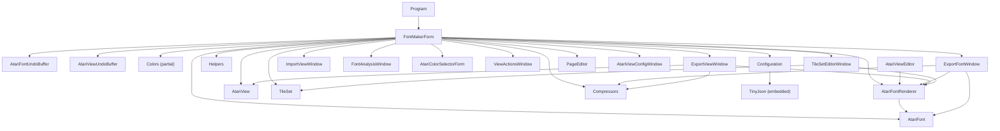
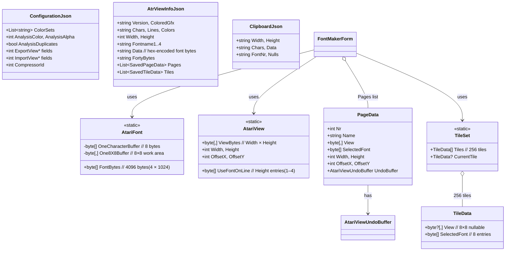

# Atari FontMaker — Architecture Analysis

> **Purpose**: This document describes the real architecture of the existing C# Atari FontMaker application. It is intended as a reference for a future migration to Rust + Slint.
>
> Conventions: **[FACT]** = directly confirmed in code; **[INFERENCE]** = logical conclusion from code; **[UNCERTAIN]** = not fully confirmed.

---

## 1. Executive Summary

**Atari FontMaker** is a desktop Windows Forms application (C# / .NET 9) for creating, editing, and exporting character fonts used by the Atari 8-bit computer family. It supports multiple Atari graphics modes (Mode 2 monochrome, Mode 4/5 with 5 colours, Mode 10 with 9 colours) and provides:

- A **character pixel editor** (8×8 grid) for editing individual font glyphs
- A **font selector** showing 512 characters across 2 font banks (4 fonts × 128 chars each)
- A **view/screen editor** (40×26 tile-map) for composing screens using the fonts
- **Multi-page** support — multiple view pages per project
- **Tile set editor** — 256 reusable 8×8 tile patterns
- **Colour palette management** — Atari palette (256 entries loaded from `altirraPAL.pal`)
- **Export** to assembler, BASIC, C, Pascal, binary, BMP, and compressed formats (ZX0/ZX1/ZX2/apultra)
- **Import** of raw binary view data
- **Font analysis** — character usage statistics across pages
- **Undo/redo** for both font and view editing
- **MegaCopy** — rectangular block copy/paste between font and view areas

### Main Inputs
- `.fnt` files — raw 1024-byte Atari font data
- `.fn2` files — dual font (2048 bytes)
- `.atrview` files — JSON project files containing fonts, view, pages, tiles, colours
- `.atrtileset` / `.atrtile` — tile set/tile JSON files
- Command-line argument: a `.fnt`, `.fn2`, or `.atrview` path

### Main Outputs
- `.fnt` / `.fn2` files
- `.atrview` project files
- Export formats: `.bmp`, `.txt` (assembler/BASIC/C/Pascal), `.dat` (binary), `.lst` (Atari BASIC listing)
- Compressed data via external executables (zx0.exe, zx1.exe, zx2.exe, apultra.exe)

---

## 2. Project Structure

```
atari-fontmaker-master/
├── FontMaker.sln                    # Solution file
├── FontMaker.csproj                 # Project file (.NET 9, WinForms)
├── Program.cs                       # Entry point
│
├── FontMakerForm.cs                 # Main form — field declarations, init, event routing
├── FontMakerForm.Designer.cs        # WinForms designer code (~85KB)
├── FontMakerForm.resx               # Form resources (images, icons)
│
│  ── Partial class files for FontMakerForm ──
├── General.cs                       # Section A: New/Load/Save/About/Quit actions
├── CharacterEditor.cs               # Section B: 8×8 character pixel editor + clipboard
├── Colors.cs                        # Section C: Colour palette management, mode switching
├── AtariViewEditor.cs               # Section D: 40×26 view editor + file I/O
├── Status.cs                        # Section E: Duplicate check, status display
├── FontSelector.cs                  # Section F: Font bank selection + MegaCopy font ops
├── Keyboard.cs                      # Keyboard navigation (prev/next char, escape)
├── PageData.cs                      # Page model + page management logic (partial form)
├── Configuration.cs                 # Configuration load/save (partial form)
│
│  ── Core model / logic classes ──
├── AtariFont.cs                     # Font data model (4096 bytes) + character ops
├── AtariFontRenderer.cs             # Bitmap renderer (unsafe pointer ops)
├── AtariView.cs                     # View data model (40×26 grid + line-font mapping)
├── AtariFontUndoBuffer.cs           # Font undo/redo (circular buffer)
├── AtariViewUndoBuffer.cs           # View undo/redo (linked-list + stack)
├── TileSet.cs                       # Tile set model (256 tiles × 8×8) + tile data
├── Constants.cs                     # App-wide constants (colour mappings, font offsets)
├── Helpers.cs                       # Utilities (resource loading, char conversion, palette search)
├── Compressors.cs                   # External compressor interface (ZX0/1/2, apultra)
├── AtrViewInfoJson.cs               # JSON DTO for .atrview file format
├── JsonSupport.cs                   # TinyJson — embedded JSON parser/writer (~566 lines)
│
│  ── Secondary windows ──
├── ExportFontWindow.cs/.Designer.cs  # Export font dialog
├── ExportViewWindow.cs/.Designer.cs  # Export view dialog
├── ImportViewWindow.cs/.Designer.cs  # Import binary data into view
├── FontAnalysisWindow.cs/.Designer.cs# Font usage analysis
├── AtariColorSelector.cs/.Designer.cs# Atari palette colour picker dialog
├── AtariViewConfigWindow.cs/.Designer.cs # View resize dialog
├── ViewActionsWindow.cs/.Designer.cs # View actions (replace char, fill, per-page ops)
├── TileSetEditorWindow.cs/.Designer.cs # Tile set editor window
├── PageEditor.cs/.Designer.cs       # Page name/order editor dialog
├── FontMakerConfigurationWindow.cs/.Designer.cs # Compressor selection dialog
│
├── Properties/                      # Assembly info, Resources.resx
├── Resources/                       # Embedded resources
│   ├── Default.fnt                  # Default 1024-byte Atari font
│   ├── default.atrview              # Default project JSON
│   ├── altirraPAL.pal               # 768-byte Atari palette (256×RGB)
│   ├── basicremfont.lst             # BASIC listing template
│   ├── zx0.exe, zx1.exe, zx2.exe   # ZX compressors
│   ├── apultra.exe                  # Apultra compressor
│   ├── FontMaker.ico                # App icon
│   ├── about_1_6.png                # Splash/about image
│   └── *.bmp                        # Toolbar button icons
└── images/                          # (directory exists, content not inspected)
```

### Namespace

All code resides in a single namespace: `FontMaker` (except `TinyJson` for the embedded JSON library).

### Single C# project

There is exactly one `.csproj` targeting `net9.0-windows7.0` with `UseWindowsForms = true` and `AllowUnsafeBlocks = True`.

---

## 3. Architecture

### 3.1 Overall Pattern

**[FACT]** The application does **not** use MVC, MVVM, MVP, dependency injection, or any formal architectural pattern. It is a **monolithic WinForms application** with a single god-class (`FontMakerForm`) that spans ~10 partial-class files and directly manages data, UI, and business logic.

### 3.2 Structural Characteristics

| Aspect | Description |
|--------|-------------|
| **Main class** | `FontMakerForm : Form` — the sole top-level form. All other windows are owned by it. |
| **Partials** | `FontMakerForm` is split into 9 partial-class files (General, CharacterEditor, Colors, AtariViewEditor, Status, FontSelector, Keyboard, PageData, Configuration) organized by GUI section. |
| **Static models** | `AtariFont`, `AtariFontRenderer`, `AtariView`, `AtariFontUndoBuffer`, `TileSet`, `Configuration`, `Compressors`, `Constants`, `Helpers` are all **static classes**. They hold global state directly. |
| **No interfaces** | Zero interfaces defined in the entire project. |
| **No DI** | All dependencies are created inline or accessed via static members. |
| **Event-driven** | GUI interactions are handled via WinForms events wired in `Designer.cs` and forwarded to `Action*` methods. |

### 3.3 Dependency Graph (simplified)



---

## 4. GUI Architecture

### 4.1 Framework

**[FACT]** Windows Forms (.NET 9). DPI mode set to `DpiUnaware`. Designer files auto-generated. Default font: Segoe UI 8.25pt.

### 4.2 Main Window Layout

The main window (`FontMakerForm`) is organized into 6 logical sections, documented in a code comment:

```
+--------+------------------+----------+--------------------------------------+
| A      | B                | C        | D                                    |
| General| Character Editor | Colors   | View/Screen editor (40×26)           |
| buttons|                  | Recolor  | Multi-page, scrollable               |
+--------+------------------+----------+                                      |
| E                                    |                                      |
| Undo/Redo/Duplicate/MegaCopy/Bank    |                                      |
+--------------------------------------+                                      |
| F                                    |                                      |
| Font selector (32×16 grid)           |                                      |
+--------------------------------------+--------------------------------------+
```

### 4.3 Windows and Dialogs

| Window/Dialog | Type | Purpose |
|---|---|---|
| `FontMakerForm` | Main Form | Everything. Single window with all sections. |
| `AtariColorSelectorForm` | Modal Dialog | 8×16 Atari colour palette picker |
| `ExportFontWindow` | Modeless Form | Export font data in various formats |
| `ExportViewWindow` | Modeless Form | Export view data in various formats |
| `ImportViewWindow` | Modeless Form | Import raw binary data into view |
| `FontAnalysisWindow` | Modeless Form | Character usage analysis across pages |
| `ViewActionsWindow` | Owned Form | Replace/fill chars in view, page switching |
| `TileSetEditorWindow` | Owned Form | Edit 256 tile sets, draw with tiles |
| `PageEditor` | Modal Dialog | Rename and reorder pages |
| `AtariViewConfigWindow` | Modal Dialog | Resize the view (width×height) |
| `FontMakerConfigurationWindow` | Modal Dialog | Select compressor type |

### 4.4 Key GUI Controls

- **PictureBox** — used extensively for all rendering (font selector, character editor, view editor, tile set, palette). All drawing is done via `Graphics.FromImage()`.
- **Rubber band overlays** — separate PictureBoxes with custom `Region` shapes for selection cursors.
- **ComboBox** — colour mode, colour sets, pages, write mode, font number, export types.
- **CheckBox** — font bank toggle (`checkBoxFontBank`), MegaCopy mode (`buttonMegaCopy`), show duplicates.
- **Buttons** — all editing operations (rotate, mirror, shift, invert, clear, undo/redo, load/save).
- **Timer** — `timerDuplicates` for blinking duplicate indicator, `timerAutoCloseAboutBox` for splash screen.
- **ScrollBars** — horizontal/vertical for view panning when view is larger than 40×26.

### 4.5 GUI ↔ Logic Coupling

**[FACT]** GUI and business logic are **tightly coupled**. Examples:

1. `AtariFont.LoadFont()` calls `MessageBox.Show()` directly on error.
2. `Colors.cs` (partial of `FontMakerForm`) reads GUI controls (`cmbColorMode.SelectedValue`, `comboBoxColorSets.SelectedIndex`) and modifies model state inline.
3. `ActionFontSelectorMouseDown()` in `FontSelector.cs` mixes coordinate calculation, model updates, GUI updates, and MegaCopy state management in a single 100-line method.
4. `RedrawView()`, `RedrawChar()`, `RedrawFonts()` are called from dozens of places throughout all partial class files.
5. Export windows access `AtariFont.FontBytes` and `AtariView.ViewBytes` directly (static global state).

---

## 5. Business Logic

### 5.1 Font Data Operations (`AtariFont`)

**File**: [AtariFont.cs](file:///c:/Users/grzes/Documents/Projects/atari-font-maker-rust/atari-fontmaker-master/AtariFont.cs)

| Responsibility | Key Methods |
|---|---|
| Storage | `FontBytes` (4096 bytes = 4 × 1024-byte fonts) |
| Load/Save | `LoadFont()`, `SaveFont()` |
| Character addressing | `GetCharacterOffset(characterIndex, onBank2)` |
| Pixel encode/decode | `DecodeMono()`, `DecodeColor2Bit()`, `DecodeColor4Bit()`, `EncodeMono()`, `EncodeColor2Bit()`, `EncodeColor4Bit()` |
| Character transforms | `RotateLeft()`, `RotateRight()`, `MirrorHorizontal()`, `MirrorVertical()`, `ShiftUp/Down/Left/Right()`, `InvertCharacter()`, `ClearCharacter()` |
| Font-level shifts | `ShiftFontLeft()`, `ShiftFontRight()`, `DeleteAndShiftLeft()`, `DeleteAndShiftRight()` |
| Colour character access | `Get2ColorCharacter()`, `Get5ColorCharacter()`, `Get4BitColorCharacter()`, `Set5ColorCharacter()`, `Set4BitCharacter()` |
| Duplicate detection | `IsDuplicate()` |

### 5.2 Font Rendering (`AtariFontRenderer`)

**File**: [AtariFontRenderer.cs](file:///c:/Users/grzes/Documents/Projects/atari-font-maker-rust/atari-fontmaker-master/AtariFontRenderer.cs) — 1181 lines

A performance-critical static class that renders all 4 fonts into a single 512×1024 `Bitmap` (`BitmapFontBanks`) using **unsafe pointer arithmetic** for direct pixel manipulation. The bitmap is organized as:

- Top 512px: 4 mono fonts (normal + inverse) × 2 banks
- Bottom 512px: 4 colour fonts (normal + inverse) × 2 banks

Each character is rendered at 2× zoom (16×16 pixels per 8×8 character).

Two rendering paths:
- `RenderAllFonts()` — re-renders entire bitmap
- `RenderOneCharacter()` — updates a single character in the bitmap

Colour modes supported:
- Mode 4/5: 2 bits per pixel → 4 colour indices (mapped through `Mode4Colors[]`)
- Mode 10: 4 bits per pixel → 16 indices (mapped through `Mode10Colors[]` with `Mode10ColorMappings[]`)

### 5.3 View Model (`AtariView`)

**File**: [AtariView.cs](file:///c:/Users/grzes/Documents/Projects/atari-font-maker-rust/atari-fontmaker-master/AtariView.cs)

Static class holding the current "screen" data:
- `ViewBytes[Width, Height]` — 2D byte array of character indices (default 40×26)
- `UseFontOnLine[Height]` — which font (1–4) each line uses
- `OffsetX/Y` — scroll position for views larger than the visible area
- `Resize()` — handles view resizing with data preservation

### 5.4 Tile System (`TileSet`, `TileData`)

**File**: [TileSet.cs](file:///c:/Users/grzes/Documents/Projects/atari-font-maker-rust/atari-fontmaker-master/TileSet.cs)

- 256 tiles, each 8×8 cells of `byte?` (nullable — null means transparent/empty)
- Each tile row has an associated font number
- `TileData` supports transforms: rotate, mirror, shift (with own undo/redo)
- Tile operations flow: tile → MegaCopy clipboard → paste into view

### 5.5 Compression (`Compressors`)

**File**: [Compressors.cs](file:///c:/Users/grzes/Documents/Projects/atari-font-maker-rust/atari-fontmaker-master/Compressors.cs)

Wraps external Windows executables (extracted from embedded resources to temp directory):
- ZX0, ZX1, ZX2, apultra
- `Compress(byte[], CompressorType)` → writes to temp file, runs process, reads result

### 5.6 Export Logic

**Files**: [ExportFontWindow.cs](file:///c:/Users/grzes/Documents/Projects/atari-font-maker-rust/atari-fontmaker-master/ExportFontWindow.cs), [ExportViewWindow.cs](file:///c:/Users/grzes/Documents/Projects/atari-font-maker-rust/atari-fontmaker-master/ExportViewWindow.cs)

Font export formats:
- BMP (mono/colour)
- Assembler (`.byte` / `dta`)
- Action! (`BYTE ARRAY`)
- Atari BASIC (`DATA` statements)
- FastBasic (`DATA` statements)
- MADS assembler (`dta`)
- C arrays
- Mad Pascal arrays
- Binary (raw bytes)
- BASIC listing (`.lst` using `basicremfont.lst` template)

View export formats: binary, assembler, Action!, BASIC, FastBasic, MADS, C, Pascal — all with optional compression and transposition.

---

## 6. Data Model

### 6.1 Core Data Structures



### 6.2 Colour State

- `AtariPalette[256]` — `Color[]` loaded from `altirraPAL.pal` (256 Atari colours as RGB triplets)
- `SetOfSelectedColors[10]` — `byte[]` of indices into `AtariPalette` (currently active palette selection)
- `BrushCache[10]` — `SolidBrush[]` built from `SetOfSelectedColors` for fast drawing
- `ColorSets` — `List<string>` of hex-encoded colour sets (6 sets, persistently saved)
- `WhichColorMode` — `int` (4, 5, or 10) determining which Atari graphics mode

### 6.3 State Summary

| State | Location | Scope |
|---|---|---|
| Font bytes | `AtariFont.FontBytes` (static) | Global |
| View bytes + line fonts | `AtariView.ViewBytes` / `UseFontOnLine` (static) | Global |
| Pages | `FontMakerForm.Pages` (instance list) | Per-project |
| Tile set | `TileSet.Tiles` (static) | Global |
| Colour palette | `FontMakerForm.AtariPalette` (instance) | Per-instance |
| Active colours | `FontMakerForm.SetOfSelectedColors` (instance) | Per-instance |
| Configuration | `Configuration.Values` (static) | Global |
| Font undo | `AtariFontUndoBuffer` (static) | Global |
| View undo | Per-page `AtariViewUndoBuffer` (instance) | Per-page |
| Tile undo | Per-tile `TileData._undoCommands` (instance) | Per-tile |

---

## 7. File Formats

### 7.1 `.fnt` — Atari Font File

| Property | Value |
|---|---|
| Format | Raw binary, exactly 1024 bytes |
| Structure | 128 characters × 8 bytes/character |
| Encoding | Each byte = 1 row of 8 pixels (MSB-first) |
| I/O | `AtariFont.LoadFont()` / `SaveFont()` — simple `FileStream.Read/Write` |

### 7.2 `.fn2` — Dual Font File

| Property | Value |
|---|---|
| Format | Raw binary, exactly 2048 bytes |
| Structure | Two consecutive 1024-byte fonts |
| I/O | `AtariFont.LoadFont()` with `dual=true` |

### 7.3 `.atrview` — Project File

| Property | Value |
|---|---|
| Format | JSON (UTF-8, serialized by TinyJson) |
| DTO | `AtrViewInfoJson` class |
| Key fields | `Version` (string, e.g. "2023"), `ColoredGfx` (0–3), `Width`/`Height`, `Chars` (hex-encoded view bytes), `Lines` (hex-encoded font-per-line), `Colors` (hex-encoded 10-byte colour selection), `Fontname1`..`Fontname4`, `Data` (hex-encoded 4096/8192 font bytes), `FortyBytes` ("0"/"1"/"2"), `Pages[]`, `Tiles[]` |
| Version handling | `version >= 1911` required; `< 2007` implies 32-wide view |
| I/O | `AtariViewEditor.LoadViewFile()` / `SaveViewFile()` |

### 7.4 `.atrtileset` — Tile Set File

| Property | Value |
|---|---|
| Format | JSON |
| DTO | `AtrTileSetJson` |
| Structure | `Version`, `List<SavedTileData>` |

### 7.5 `.atrtile` — Single Tile File

| Property | Value |
|---|---|
| Format | JSON |
| DTO | `AtrTileJson` |
| Structure | `Version`, one `SavedTileData` |

### 7.6 `FontMaker.json` — Application Configuration

| Property | Value |
|---|---|
| Format | JSON |
| DTO | `ConfigurationJson` |
| Location | Same directory as executable |
| I/O | `Configuration.Load()` / `Save()` via TinyJson |

### 7.7 `altirraPAL.pal` — Palette

| Property | Value |
|---|---|
| Format | Raw binary, 768 bytes (256 × 3 bytes RGB) |
| Source | Embedded resource from Altirra emulator |

### 7.8 Clipboard Format

| Property | Value |
|---|---|
| Format | JSON string on system clipboard |
| DTO | `ClipboardJson` |
| Fields | `Width`, `Height`, `Chars` (hex), `Data` (hex font bytes), `FontNr`, `Nulls` |

---

## 8. Dependencies

### 8.1 Framework Dependencies

| Dependency | Purpose |
|---|---|
| .NET 9.0 (Windows) | Runtime |
| Windows Forms | GUI framework |
| `System.Drawing` / GDI+ | All bitmap rendering |
| `System.Drawing.Imaging` | `BitmapData` / `LockBits` for unsafe pixel manipulation |
| `Microsoft.VisualBasic` | Used in `AtariViewEditor.cs` for `Interaction.InputBox` (rename pages) |

### 8.2 Embedded Libraries

| Library | Purpose |
|---|---|
| **TinyJson** | Minimal JSON parser/writer (~566 lines, embedded in `JsonSupport.cs`). No NuGet dependency. |

### 8.3 External Executables (Embedded Resources)

| Executable | Purpose |
|---|---|
| `zx0.exe` | ZX0 compression |
| `zx1.exe` | ZX1 compression |
| `zx2.exe` | ZX2 compression |
| `apultra.exe` | Apultra compression |

These are extracted to `%TEMP%/afm2025/` at startup and invoked via `Process.Start()`.

### 8.4 NuGet Packages

**None.** The project has zero NuGet package references. **[FACT]**

---

## 9. Data Flows

### 9.1 Application Startup

```
Program.Main()
  → FontMakerForm()
    → InitializeComponent() (Designer)
    → Compressors.Prepare() (extract exes to temp)
    → FormCreate event:
      → AtariFontUndoBuffer.Setup()
      → AtariView.Setup()
      → TileSet.Setup()
      → LoadPalette() (altirraPAL.pal → AtariPalette[256])
      → LoadConfiguration() (FontMaker.json)
      → BuildColorModeList()
      → Parse command-line args
        → LoadViewFile() or LoadFont() depending on extension
      → SetupDefaultPalColors() / BuildBrushCache()
      → BuildColorSetList() / BuildPageList()
      → RedrawFonts() → RedrawView() → RedrawPal() → RedrawChar()
      → AtariFontUndoBuffer.Add2UndoInitial()
```

### 9.2 Character Editing Flow

```
User clicks in pictureBoxCharacterEditor
  → ActionCharacterEditorMouseDown(MouseEventArgs)
    → Calculate pixel position (rx, ry)
    → Read current font byte: AtariFont.FontBytes[offset + ry]
    → Decode byte to pixel array (DecodeMono / DecodeColor2Bit / DecodeColor4Bit)
    → Toggle/set pixel value based on button (L=draw, R=erase)
    → Encode pixel array back to byte (EncodeMono / EncodeColor2Bit / EncodeColor4Bit)
    → Write byte back: AtariFont.FontBytes[offset + ry] = encoded
    → DoChar():
      → UpdateUndoButtons()
      → AtariFontRenderer.RenderOneCharacter() → updates BitmapFontBanks
      → Copy from BitmapFontBanks to pictureBoxFontSelector
    → Draw pixel directly in editor PictureBox
    → RedrawViewChar() — update all occurrences in view
    → UpdateUndoButtons()
    → CheckDuplicate()
```

### 9.3 View Editing Flow

```
User clicks in pictureBoxAtariView
  → ActionAtariViewEditorMouseDown(MouseEventArgs)
    → Calculate (rx, ry) from pixel coords + offset
    → If left button (draw mode):
      → PushState() (undo buffer)
      → AtariView.ViewBytes[rx, ry] = SelectedCharacterIndex % 256
      → RedrawViewChar()
    → If right button (pick mode):
      → Read char from AtariView.ViewBytes[rx, ry]
      → Switch font bank if necessary
      → Select char in font selector
```

### 9.4 Save/Load `.atrview` Flow

```
SaveViewFile(filename):
  → SwopPage(saveCurrent: true) — save current page data
  → Create AtrViewInfoJson
  → Populate: version, gfx mode, view bytes (hex), line fonts (hex),
    colours (hex), font names, font data (hex), pages, tiles
  → jo.ToJson() → File.WriteAllText()

LoadViewFile(filename):
  → Read JSON → FromJson<AtrViewInfoJson>()
  → Parse version, gfx mode
  → AtariView.ForcedResize(width, height)
  → AtariView.Load(lines, chars, viewWidth) — from hex strings
  → SetOfSelectedColors = Convert.FromHexString(colors)
  → AtariFont.FontBytes = Convert.FromHexString(fontData)
  → Load pages → PageData constructors from SavedPageData
  → Load tiles → TileSet.Load(tileData)
  → SetupColorMode(coloredGfx)
```

---

## 10. Key Algorithms

### 10.1 Character Offset Calculation

**File**: [AtariFont.cs](file:///c:/Users/grzes/Documents/Projects/atari-font-maker-rust/atari-fontmaker-master/AtariFont.cs#L103-L119) — `GetCharacterOffset()`

Maps a character index (0–511) to a byte offset in the 4096-byte `FontBytes` array. The mapping is non-trivial because character indices 0–255 map to fonts 1+2 and 256–511 map to fonts 3+4, with each font being 128 chars × 8 bytes. The `ry` adjustment logic handles the visual layout → byte offset translation.

### 10.2 Font Bitmap Rendering

**File**: [AtariFontRenderer.cs](file:///c:/Users/grzes/Documents/Projects/atari-font-maker-rust/atari-fontmaker-master/AtariFontRenderer.cs#L73-L914) — `RenderAllFonts()`

Uses `Bitmap.LockBits()` + `unsafe` pointer arithmetic to render all 4 fonts simultaneously at 2× zoom in both mono and colour modes. Each pixel is written twice (horizontal) and the same row is written to two consecutive scanlines (vertical) for the 2× zoom effect. Three distinct rendering paths for mono (1-bit), Mode 4/5 (2-bit), and Mode 10 (4-bit).

**Critical for migration**: This is the most performance-sensitive code in the application. The unsafe pointer manipulation must be replicated efficiently in Rust.

### 10.3 Bit Manipulation for Colour Modes

**File**: [AtariFont.cs](file:///c:/Users/grzes/Documents/Projects/atari-font-maker-rust/atari-fontmaker-master/AtariFont.cs#L327-L415)

- `DecodeMono(byte)` → 8 pixels (1-bit each)
- `DecodeColor2Bit(byte)` → 4 pixels (2-bit each, Mode 4/5)
- `DecodeColor4Bit(byte)` → 2 pixels (4-bit each, Mode 10)
- Corresponding `Encode*()` functions

### 10.4 Horizontal Mirror (Bit Reversal)

**File**: [AtariFont.cs](file:///c:/Users/grzes/Documents/Projects/atari-font-maker-rust/atari-fontmaker-master/AtariFont.cs#L188-L209)

Uses three different algorithms depending on pixel width:
- 1-bit: bit-reversal hack `((v * 0x0802LU & 0x22110LU) | (v * 0x8020LU & 0x88440LU)) * 0x10101LU >> 16`
- 2-bit: pair swap
- 4-bit: nibble swap

### 10.5 Duplicate Character Detection

**File**: [FontSelector.cs](file:///c:/Users/grzes/Documents/Projects/atari-font-maker-rust/atari-fontmaker-master/FontSelector.cs#L97-L130) — `FindDuplicateChar()`

Searches cyclically through 128 characters in the same half (normal/inverse) of the current font to find byte-identical characters. Uses `CompareChars()` which compares 8 bytes.

### 10.6 Closest Palette Colour Search

**File**: [Helpers.cs](file:///c:/Users/grzes/Documents/Projects/atari-font-maker-rust/atari-fontmaker-master/Helpers.cs#L141-L162) — `FindClosest()`

Euclidean distance in RGB space, searching only even palette indices (Atari palette has 128 unique hues).

---

## 11. Application State

### 11.1 Global Static State

| Class | Static Data | Mutable? |
|---|---|---|
| `AtariFont` | `FontBytes[4096]` | Yes |
| `AtariView` | `ViewBytes[W,H]`, `UseFontOnLine[H]`, `Width`, `Height`, `OffsetX`, `OffsetY` | Yes |
| `AtariFontUndoBuffer` | `undoBuffer[251, 4096]`, `undoBufferFlags[251]`, `undoBufferIndex` | Yes |
| `TileSet` | `Tiles[256]`, `CurrentTile` | Yes |
| `AtariFontRenderer` | `BitmapFontBanks`, colour caches, `WhichColorMode` | Yes |
| `Configuration` | `Values` (ConfigurationJson) | Yes |
| `Constants` | Lookup tables | No (readonly) |
| `Program` | `MainForm` | Yes |

### 11.2 Instance State (FontMakerForm)

Key mutable fields:
- `AtariPalette[256]`, `SetOfSelectedColors[10]`, `BrushCache[10]`
- `InColorMode`, `WhichColorMode`, `InMode5`
- `SelectedCharacterIndex`, `DuplicateCharacterIndex`
- `Font1Filename`..`Font4Filename`, `CurrentDataFolder`
- `Pages` (list), `CurrentPage`, `CurrentPageIndex`
- `ColorSets` (list), `CurrentColorSetIndex`
- `megaCopyStatus`, `CopyPasteRange`, `CopyPasteTargetLocation`
- `CompressorId`
- `FortyBytes` (view width indicator)

### 11.3 State Modification Points

Font data is modified from: `CharacterEditor` (pixel editing), `FontSelector` (MegaCopy paste), `General` (load/clear), `AtariViewEditor` (load view file), and the undo system.

View data is modified from: `AtariViewEditor` (mouse draw, load file), `PageData` (page swap), `ViewActionsWindow` (replace/fill), and the undo system.

---

## 12. Concurrency and Async

**[FACT]** The application is **entirely single-threaded**. There is no use of:
- `async`/`await`
- `Task` / `Task.Run()`
- `BackgroundWorker`
- `Thread` / `ThreadPool`

The only timed operations are:
- `timerDuplicates` — blinks the duplicate indicator on the UI thread
- `timerAutoCloseAboutBox` — auto-hides the splash screen after a timeout

The external compressor processes (`Process.Start()` + `WaitForExit()`) block the UI thread during compression. **[FACT]**

---

## 13. Error Handling

### 13.1 Pattern

Error handling is minimal and follows a simple pattern:
- `try/catch` around file I/O with `MessageBox.Show()` for user notification
- Many `catch` blocks silently ignore exceptions (e.g., `Configuration.Load()`, `Configuration.Save()`, `Compressors.Prepare()`)
- No logging framework
- No custom exception types

### 13.2 Validation

- `AtariFont.LoadFont()` checks if bytes read match expected size and shows a warning MessageBox
- `Configuration.VerifyDefaults()` clamps out-of-range values to valid defaults
- `ClipboardJson.VerifyWidthHeight()` validates parsed dimensions
- `ClipboardJson.Fix*()` methods pad missing data with zeros
- GUI boundary checks (`e.X >= 0 && e.X < WIDTH`) prevent out-of-bounds access in mouse handlers

### 13.3 Notable Error Patterns

- `AtariFont.LoadFont()` catches any exception and shows error in a MessageBox — **this mixes UI and model** **[FACT]**
- `LoadViewFile()` wraps the entire load in try/catch and falls back to defaults on failure
- `Compressors.Compress()` returns the original uncompressed data on any failure

---

## 14. Testing

**[FACT]** There are **no tests** of any kind in the project:
- No unit tests
- No integration tests
- No test project in the solution
- No test framework references

The `FontMaker.sln` contains exactly one project (`FontMaker.csproj`).

---

## 15. Migration-Critical Areas

### 15.1 Unsafe Bitmap Rendering

`AtariFontRenderer.RenderAllFonts()` and `RenderOneCharacter()` use C# `unsafe` code with raw pointer arithmetic on `BitmapData.Scan0`. This must be replicated in Rust using an appropriate pixel buffer (e.g., a Slint `Image` backed by a `SharedPixelBuffer`).

### 15.2 WinForms Dependency

The entire GUI is built with WinForms Designer-generated code. Every form has a `.Designer.cs` file with hardcoded pixel positions, sizes, and control hierarchies. This must be completely reimplemented in Slint.

### 15.3 Tight GUI-Logic Coupling

`FontMakerForm` is a ~1668-line partial class spanning ~10 files. Business logic methods (`ActionFontSelectorMouseDown`, `InteractWithTheColorPalette`, `SwitchGfxMode`, etc.) directly read/write GUI controls and call `Refresh()`. **Separation of concerns is the largest refactoring challenge.**

### 15.4 Static Global State

Virtually all core data (`AtariFont`, `AtariView`, `AtariFontRenderer`, `TileSet`, `AtariFontUndoBuffer`, `Configuration`) is stored as static mutable state. In Rust, this must be redesigned — either as owned structs passed explicitly or wrapped in `Arc<Mutex<>>` if shared.

### 15.5 GDI+ Drawing

All view and font rendering uses `System.Drawing.Graphics` with `DrawImage()`, `FillRectangle()`, `DrawString()`, etc. The `InterpolationMode.NearestNeighbor` + `WrapMode.TileFlipXY` combination for tile-based rendering must be reproduced.

### 15.6 Clipboard Interop

Copy/paste uses `Clipboard.SetText()` / `Clipboard.GetText()` with a custom JSON format (`ClipboardJson`). The Rust side must implement the same JSON schema for clipboard compatibility.

### 15.7 External Process Execution

Compressors are Windows `.exe` files extracted from embedded resources and executed via `Process.Start()`. For cross-platform Rust, consider:
- Porting compression algorithms to Rust crates
- Or maintaining the same process-based approach

### 15.8 Embedded Resources

Resources are loaded via `Assembly.GetManifestResourceStream()` in `Helpers.GetResource<T>()`. In Rust, these should be included via `include_bytes!()` or similar.

### 15.9 `Microsoft.VisualBasic.Interaction.InputBox`

Used in `AtariViewEditor.cs` for text input. Must be replaced with a Slint dialog.

### 15.10 TinyJson Library

The embedded TinyJson parser/writer (~566 lines) handles all JSON serialization. In Rust, use `serde` + `serde_json`.

### 15.11 Hex Encoding Convention

Data is extensively stored as hex strings (`Convert.ToHexString()` / `Convert.FromHexString()`). The `.atrview` file format depends on this. Must be preserved for file format compatibility.

### 15.12 Colour Mode Complexity

The interplay between `InColorMode`, `WhichColorMode` (4/5/10), `InMode5`, and `checkBoxFontBank.Checked` affects character addressing, pixel widths, editor dimensions, view heights, and rendering paths. Many methods branch on these states.

---

## 16. Proposed Migration Modules

Based on dependency analysis and coupling assessment, the recommended migration order:

### Phase 1: Foundation (no GUI dependency)

1. **Constants & Lookup Tables**
   - `Constants.cs` → Rust constants module
   - Trivial, no dependencies

2. **Atari Palette**
   - Loading `altirraPAL.pal` (768 bytes → 256 RGB colours)
   - `Helpers.FindClosest()` — palette matching
   - Pure data, no GUI

3. **Font Data Model**
   - `AtariFont.cs` (excluding `MessageBox.Show()` calls)
   - Core byte manipulation: encode/decode (mono, 2-bit, 4-bit)
   - Character transforms (rotate, mirror, shift, invert, clear)
   - Font-level shifts
   - **Justification**: Largest block of pure logic, can be unit-tested extensively

4. **View Data Model**
   - `AtariView.cs` — data structure, resize, load from hex, undo info
   - Pure data model

5. **Tile Data Model**
   - `TileData`, `TileSet` — data structures, transforms, save/load
   - Pure data with own undo/redo

### Phase 2: File Formats

6. **File Format I/O**
   - `.fnt` / `.fn2` file reading/writing (trivial binary)
   - `.atrview` JSON format (using serde)
   - `.atrtileset` / `.atrtile` JSON formats
   - `FontMaker.json` configuration
   - **Justification**: Testable independently, file compatibility is critical

### Phase 3: Undo/Redo & State

7. **Undo/Redo Systems**
   - `AtariFontUndoBuffer` — circular buffer for font data
   - `AtariViewUndoBuffer` — linked list + stack for view data
   - `TileData` undo — linked list + stack for tiles

8. **Application State**
   - Consolidate all mutable state into a single `AppState` struct
   - Colour management (sets, modes, brush equivalents)
   - Page management

### Phase 4: Rendering

9. **Font Renderer**
   - Port `AtariFontRenderer` to Rust
   - Target a raw pixel buffer (e.g., `Vec<u32>` in ARGB format)
   - Replicate all three rendering paths (mono, 2-bit colour, 4-bit colour)
   - **Justification**: Must be ported before GUI can show anything meaningful

### Phase 5: Export/Import

10. **Export Logic**
    - Font export (assembler, BASIC, C, Pascal, binary, BMP, BASIC listing)
    - View export (same formats)
    - Compression integration

11. **Import Logic**
    - Binary view import

### Phase 6: GUI

12. **Slint GUI**
    - Main window layout (6 sections)
    - Character editor (pixel grid)
    - Font selector (32×16 grid)
    - View editor (40×26 grid with scrolling)
    - Colour palette and mode switching
    - All dialogs (export, import, analysis, tile editor, page editor, colour picker, config)
    - Keyboard shortcuts
    - MegaCopy clipboard system
    - **Justification**: Last because it depends on everything else; largest effort

### Phase 7: Integration

13. **Integration & Polish**
    - Command-line argument handling
    - Splash screen / about box
    - Window management (owned forms)
    - Clipboard interop
    - Cross-platform testing

---

## 17. Open Questions / Uncertainties

1. **`images/` directory**: Contents not inspected. May contain additional assets used by the application. **[UNCERTAIN]**

2. **`.fn2` command-line loading**: The code has a `TODO: Load a .fn2 file` comment and the feature appears incomplete. **[FACT — based on comment in code]**

3. **Mac compatibility**: Multiple comments reference "when running on Mac things get funky" with bounds checks. It's unclear if the app was ever seriously used on macOS via .NET. **[UNCERTAIN]**

4. **Forty-bytes mode**: The `FortyBytes` field and `comboBoxBytes` control switch between 32, 40, and 48 character widths. The precise relationship between this setting and `AtariView.Width` when the view is resizable beyond standard dimensions needs careful testing. **[UNCERTAIN — complex interaction]**

5. **Colour 3 / PF2 dual-colour behaviour**: In Mode 4/5, colour index 3 (PF2) has different behaviour for normal vs inverse characters (indices 0–127 vs 128–255). The inverse variant uses index 4 (PF3). This is scattered across rendering and editing code and needs careful preservation. **[FACT but complex]**

6. **`basicremfont.lst` template**: Used by `ExportFontWindow.SaveRemFont()` to generate BASIC `.lst` files. The exact template format was not deeply analysed. **[UNCERTAIN — exact template structure]**

7. **TinyJson edge cases**: The embedded JSON parser has known limitations (no JIT emit, <2GB files, no abstract classes). Any `.atrview` files with unusual content could trigger edge cases. **[FACT — documented in code comments]**

8. **View undo buffer per-page behaviour**: Each `PageData` has its own `AtariViewUndoBuffer`. The interaction between page switching, undo buffer state, and the global `AtariView` data needs careful analysis to avoid undo desynchronisation. **[INFERENCE]**

9. **Font bank checkbox vs font number mapping**: The relationship between `checkBoxFontBank.Checked` (boolean for bank 1-2 vs 3-4), `SelectedCharacterIndex` (0–511), and `UseFontOnLine` (1–4) involves complex conditional logic scattered across multiple files. **[FACT — complex interactions]**

10. **Clipboard compatibility**: If the Rust version must interoperate with the C# version via clipboard copy/paste, the `ClipboardJson` format must be byte-compatible. The exact behaviour of TinyJson serialisation (field order, whitespace) may matter. **[UNCERTAIN]**
