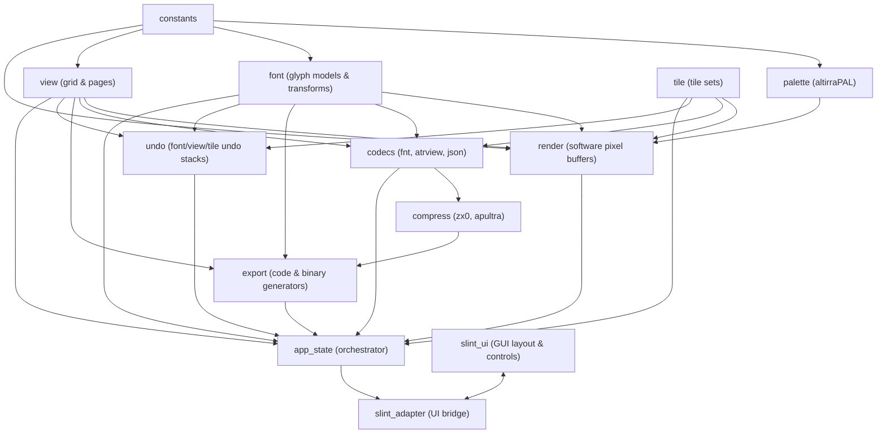

# Migration Plan: Atari FontMaker (C# → Rust + Slint)

> **Status**: Technical Migration Plan  
> **Source Codebase**: `atari-fontmaker-master/` (C# / .NET 9 WinForms)  
> **Reference Architecture**: `docs/architecture.md`  
> **Target Stack**: Rust (2024 edition) + Slint UI  
> **Target Platforms**: Windows & Linux (x86_64)

---

## 1. Migration Goals

1. **Full Functional Parity**: Replicate all features of the existing C# application:
   - 4-font bank management (4096 bytes total).
   - Character glyph editing in 1-bit monochrome, Mode 4/5 (2-bit, 5 colors), and Mode 10 (4-bit, 9 colors).
   - 40×26 view editor with multi-page support and font-per-line assignments.
   - 256-tile tile set editor with transformation tools.
   - Full export options: C arrays, Assembler, Action!, Atari BASIC, FastBasic, MADS, Mad Pascal, raw binary, BMP, and BASIC `.lst` listing.
   - Full import capabilities (raw binary view import).
   - Character usage statistics and duplicate detection.
   - Comprehensive Undo/Redo systems across font, view, and tile workflows.
   - MegaCopy rectangle copy/paste between font selector and view editor.
2. **Strict File Format & Asset Compatibility**:
   - 100% read/write compatibility with existing `.fnt`, `.fn2`, `.atrview`, `.atrtileset`, `.atrtile`, and `FontMaker.json`.
   - Native Atari palette parsing (`altirraPAL.pal`).
   - Identical clipboard JSON format (`ClipboardJson`) for interop.
3. **Cross-Platform Portability**:
   - Native execution on Windows and Linux without Wine or platform-locked Windows Forms/GDI+ dependencies.
   - Replacement of external Windows-only compressor binaries (`zx0.exe`, etc.) with native Rust crate algorithms.
4. **Idiomatic Rust & Modern Slint Architecture**:
   - Decouple GUI from business logic using a clean, layered architecture (Domain Model → Application Services → Slint UI Adapter).
   - Replace mutable static global state with encapsulated, thread-safe, owned state.
   - Fast, memory-safe pixel rendering to Slint image buffers without unsafe pointer risks.

---

## 2. Current Architecture Summary

The existing C# application is a **monolithic Windows Forms desktop app** with the following characteristics:

- **Tight Coupling & Monolithic God-Class**: `FontMakerForm` spans ~10 partial class files (~5,000+ lines total) that mix UI event handlers, direct GDI+ rendering, bit manipulation, and file I/O.
- **Global Mutable State**: `AtariFont`, `AtariView`, `AtariFontRenderer`, `TileSet`, and `Configuration` are static classes with globally accessible mutable fields.
- **Direct Pointer Rendering**: `AtariFontRenderer` uses C# `unsafe` pointer arithmetic with `Bitmap.LockBits()` on a monolithic 512×1024 backing bitmap.
- **Embedded External Tools**: Compression relies on extracting Windows `.exe` files (`zx0.exe`, `zx1.exe`, `zx2.exe`, `apultra.exe`) to `%TEMP%`.
- **Zero Test Coverage**: No unit tests, integration tests, or CI pipelines exist in the legacy project.

---

## 3. Target Architecture

The Rust + Slint application will be organized into four clear layers:

```
┌─────────────────────────────────────────────────────────────┐
│                       Slint UI Layer                        │
│   (.slint files: Main Window, Panels, Dialogs, Slint Models)│
└──────────────────────────────┬──────────────────────────────┘
                               │ Slint Callbacks / Properties
┌──────────────────────────────▼──────────────────────────────┐
│                    UI Adapter / Presenter                   │
│   (State management, Image generation, Event dispatching)   │
└──────────────────────────────┬──────────────────────────────┘
                               │ Rust method calls
┌──────────────────────────────▼──────────────────────────────┐
│                  Application Services Layer                 │
│   (Commands, Undo/Redo Engine, Clipboard, Import/Export)    │
└──────────────────────────────┬──────────────────────────────┘
                               │ Domain operations
┌──────────────────────────────▼──────────────────────────────┐
│                     Domain & Core Models                    │
│   - Palette & Color Engine                                  │
│   - Font Data & Bit Manipulation (Mono, Mode 4/5, Mode 10)  │
│   - View Screen (40×26 Grid, Font-per-Line)                 │
│   - Tile Sets (256 Tiles, 8×8 Matrix)                       │
│   - Software Pixel Buffer Renderer (RGBA8 / Slint Image)    │
│   - File Formats & Codecs (.fnt, .fn2, .atrview, serde JSON)│
└─────────────────────────────────────────────────────────────┘
```

### Module Responsibilities

| Layer / Module | Technologies | Responsibilities |
|---|---|---|
| **Domain: `palette`** | Rust | Load Atari 256-color palette (`altirraPAL.pal`), color distance calculation, color set management. |
| **Domain: `font`** | Rust | 4096-byte font buffer, glyph addressing, bit manipulation (1-bit mono, 2-bit Mode 4/5, 4-bit Mode 10), character transforms (rotate, mirror, shift, invert). |
| **Domain: `view`** | Rust | Screen buffer (`ViewBytes`), font assignments per line (`UseFontOnLine`), page models, screen resizing. |
| **Domain: `tile`** | Rust | 256 tiles, 8×8 character matrix, per-tile font mappings, tile transforms. |
| **Domain: `render`** | Rust | Fast pure-Rust software renderer transforming font & view data into Slint `Rgba8Pixel` buffers / `SharedPixelBuffer`. |
| **Domain: `codecs`** | Rust (`serde`, `serde_json`, `image`) | Parsers and writers for `.fnt`, `.fn2`, `.atrview`, `.atrtileset`, `FontMaker.json`, hex encoders/decoders, native ZX0/apultra compression. |
| **App: `undo`** | Rust | Generic command-based or snapshot-based undo/redo stacks for fonts, views, and tiles. |
| **App: `export`** | Rust | Text/code generation (ASM, BASIC, C, Action!, FastBasic, MADS, Mad Pascal) and binary/BMP exports. |
| **App: `app_state`** | Rust | Central application container holding fonts, current view, active page, tile set, color configuration, selection, and clipboard state. |
| **UI Adapter** | Rust (`slint`) | Bridges Rust `AppState` with Slint component handles, manages Slint models/timers, dispatches UI callbacks. |
| **GUI** | Slint (`.slint`) | Declarative UI markup: toolbar, character editor grid, font selector canvas, view editor canvas, recoloring panel, dialogs. |

---

## 4. Migration Phases

```mermaid
gantt
    title Migration Roadmap
    dateFormat  X
    axisFormat  Phase %X
    section Core Domain
    Phase 1: Test Harness & Foundation      :0, 2
    Phase 2: Font & Color Domain Models     :2, 4
    Phase 3: View, Pages & Tile Sets        :4, 6
    section Infrastructure
    Phase 4: File Formats & Codecs          :6, 8
    Phase 5: Native Compression & Export    :8, 10
    Phase 6: Software Renderer Engine       :10, 12
    Phase 7: Undo/Redo & State Management   :12, 14
    section GUI & Integration
    Phase 8: Slint UI Shell & Editors       :14, 17
    Phase 9: Secondary Windows & Dialogs    :17, 19
    Phase 10: Full Integration & Polish     :19, 21
    Phase 11: Cross-Platform Validation     :21, 23
```

### Phase 1: Test Harness & Foundation
- **Goal**: Establish project structure, golden reference test fixtures from C#, and baseline palette/constant definitions.
- **Included Modules**: `afm_core::constants`, `afm_core::palette`, test fixtures generator.
- **Prerequisites**: Existing C# codebase + `docs/architecture.md`.
- **Deliverables**:
  - Validated 256-color Atari palette loader (`altirraPAL.pal`).
  - Unit tests for palette color lookup and nearest color matching.
  - Golden test vectors extracted from standard fonts (`Default.fnt`, `default.atrview`).
- **Completion Criteria**: `cargo test` passes; palette exact RGB match with Altirra palette.

### Phase 2: Font Data Model & Glyph Transformations
- **Goal**: Implement font storage, character addressing, bit encodings/decodings, and all glyph transformation algorithms.
- **Included Modules**: `afm_core::font` (mono, 2-bit, 4-bit decoders/encoders, rotate, shift, mirror, invert, clear, font shifts, duplicate checks).
- **Prerequisites**: Phase 1.
- **Deliverables**:
  - `FontBank` (4096 bytes) and `Character` representations.
  - Glyph manipulation algorithms with 100% bitwise parity with C#.
- **Completion Criteria**: Comprehensive unit tests comparing every transform output against C# golden masters.

### Phase 3: View Screen, Pages & Tile Set Models
- **Goal**: Model the 40×26 view editor, multi-page document structure, and the 256-tile system.
- **Included Modules**: `afm_core::view`, `afm_core::page`, `afm_core::tile`.
- **Prerequisites**: Phase 2.
- **Deliverables**:
  - `ViewGrid` (resizable, default 40×26, custom width 32/40/48).
  - `PageData` management (reorder, rename, clone).
  - `TileSet` and `TileData` (8×8 nullable cells, per-tile font assignments, tile transforms).
- **Completion Criteria**: Unit tests verifying view mutations, tile transforms, and page transitions.

### Phase 4: File Formats & Compatibility Codecs
- **Goal**: Implement lossless serialization and deserialization for all Atari FontMaker project files.
- **Included Modules**: `afm_codecs::fnt`, `afm_codecs::atrview`, `afm_codecs::atrtileset`, `afm_codecs::config`, `afm_codecs::clipboard`.
- **Prerequisites**: Phases 2 & 3.
- **Deliverables**:
  - Serde-based `.atrview` reader/writer supporting all schema versions (`v1911`, `v2007`, `v2023`).
  - Raw binary `.fnt` (1024 B) and `.fn2` (2048 B) handlers.
  - JSON clipboard serializer/deserializer matching C# `ClipboardJson`.
- **Completion Criteria**: Golden test suite loads all example `.atrview` and `.fnt` files, reserializes them, and matches original data.

### Phase 5: Native Compression & Code Exporters
- **Goal**: Implement file export generators and replace external Windows executables with cross-platform native compression.
- **Included Modules**: `afm_export` (ASM, BASIC, FastBasic, Action!, MADS, C, Mad Pascal, BMP, BASIC `.lst`), `afm_compress` (ZX0, ZX1, ZX2, apultra).
- **Prerequisites**: Phase 4.
- **Deliverables**:
  - Pure-Rust or vendored C-FFI ZX0/apultra compression routines.
  - Exporter formatting matching exact C# line numbers, headers, hex formats, and data tables.
- **Completion Criteria**: Export output diff test matches C# export output byte-for-byte.

### Phase 6: Software Renderer Engine
- **Goal**: Create a high-performance software renderer that produces Slint-compatible pixel buffers from font and view states.
- **Included Modules**: `afm_render::font_renderer`, `afm_render::view_renderer`, `afm_render::tile_renderer`.
- **Prerequisites**: Phases 2, 3, 5.
- **Deliverables**:
  - Pure-Rust 2× zoomed font bank atlas generator (replacing C# `Bitmap.LockBits()` pointer arithmetic).
  - View screen renderer handling Mode 2, Mode 4/5 (including inverted PF2/PF3 color switch), and Mode 10.
  - Partial/dirty rendering optimizations (`render_single_character`, `render_dirty_view_cells`).
- **Completion Criteria**: Image comparison tests against C# GDI+ renders with zero pixel mismatch.

### Phase 7: Application State & Undo/Redo Engine
- **Goal**: Integrate domain models into an encapsulated `AppState` service with full Undo/Redo support.
- **Included Modules**: `afm_app::state`, `afm_app::undo`, `afm_app::actions`.
- **Prerequisites**: Phases 1–6.
- **Deliverables**:
  - Circular font undo buffer (matching C# 250-level buffer).
  - Per-page view undo/redo stack.
  - Tile undo/redo stack.
  - Action dispatching API (draw pixel, apply transform, swap page, recolor, MegaCopy).
- **Completion Criteria**: State transition unit tests verify complex undo/redo sequences without state desynchronization.

### Phase 8: Slint UI — Main Window & Core Editors
- **Goal**: Implement the primary Slint window containing the 6 main functional sections.
- **Included Modules**: `ui/main_window.slint`, `ui/char_editor.slint`, `ui/font_selector.slint`, `ui/view_editor.slint`, `ui/color_panel.slint`, `ui/toolbar.slint`.
- **Prerequisites**: Phase 7.
- **Deliverables**:
  - Pixel grid character editor with drawing modes (pencil, eraser, toggle).
  - 32×16 font bank selector with rubberband selection and duplicate indicators.
  - 40×26 view editor canvas with font indicators and smooth panning/scrolling.
  - Slint-to-Rust callback bindings and state synchronizers.
- **Completion Criteria**: Full interactive character and view editing functional in Slint.

### Phase 9: Secondary Windows & Dialogs
- **Goal**: Recreate all secondary dialogs and specialized tool windows in Slint.
- **Included Modules**:
  - Export Font / Export View Dialogs
  - Import View Dialog
  - Font Analysis Window (character count heatmaps & duplicates)
  - Tile Set Editor Window
  - Page Reorder/Rename Editor
  - Atari Color Selector Dialog
  - View Resize Configuration Window
- **Prerequisites**: Phase 8.
- **Deliverables**:
  - Responsive Slint modal and non-modal dialog components.
  - Two-way binding with `AppState`.
- **Completion Criteria**: All dialogs trigger their respective actions, load configurations, and update state correctly.

### Phase 10: Full Integration & Polish
- **Goal**: Connect command-line argument loading, keyboard shortcuts, clipboard integration, and preferences persistence.
- **Included Modules**: `main.rs`, CLI parser, cross-platform clipboard connector, configuration store.
- **Prerequisites**: Phase 9.
- **Deliverables**:
  - CLI file loading (`afm file.atrview` / `afm file.fnt`).
  - Keyboard shortcuts parity (`Ctrl+Z`, `Ctrl+Y`, `Ctrl+C`, `Ctrl+V`, `R`, `M`, `I`, `0-9`).
  - System clipboard copy/paste interop.
- **Completion Criteria**: Complete manual walkthrough verifying every button and shortcut.

### Phase 11: Cross-Platform Validation
- **Goal**: Validate building and running identically on Windows and Linux.
- **Deliverables**:
  - Automated CI test matrix on `windows-latest` and `ubuntu-latest`.
  - Linux Wayland/X11 rendering verification.
  - Binary packaging.
- **Completion Criteria**: Zero platform-specific build failures or runtime visual artifacts.

---

## 5. Module Dependency Graph



---

## 6. Module Migration Order

| Order | Module | Rationale | Difficulty | Risk Level |
|---|---|---|---|---|
| **1** | `constants` | Pure lookup tables and constants; zero dependencies. | Low | Negligible |
| **2** | `palette` | Self-contained palette loader and color math. | Low | Low |
| **3** | `font` | Core domain logic. Can be 100% unit tested without GUI. | Medium | Low |
| **4** | `view` | Screen data models and page management. Pure logic. | Low | Low |
| **5** | `tile` | Tile data models and tile transforms. Pure logic. | Low | Low |
| **6** | `codecs` | File I/O and JSON schema compatibility. Easy to verify via golden files. | Medium | Medium |
| **7** | `compress` | Native compression implementation. | Medium | Low |
| **8** | `export` | Text formatters and code generation based on domain state. | Medium | Low |
| **9** | `render` | Pixel buffer rendering (Mode 2/4/5/10). Performance-critical. | High | Medium |
| **10** | `undo` | Snapshot and delta undo/redo engines. | Medium | Medium |
| **11** | `app_state` | Unification of all domain modules into a single service layer. | High | Medium |
| **12** | `slint_ui` & `slint_adapter` | Full GUI implementation in Slint. | High | High |
| **13** | `cli` & integration | Command line, clipboard, window lifecycle, packaging. | Medium | Low |

---

## 7. Testing Strategy

```
┌─────────────────────────────────────────────────────────────┐
│                    GUI & Interaction Tests                  │
│       (Slint UI component tests, end-to-end user flows)     │
├─────────────────────────────────────────────────────────────┤
│                    Integration Tests                        │
│   (File Load → State Mutation → Undo/Redo → Export → Verify)│
├─────────────────────────────────────────────────────────────┤
│                 Golden-Master / Characterization            │
│   (Bitwise comparison of C# output vs Rust output for all   │
│          transforms, renders, exports, and files)           │
├─────────────────────────────────────────────────────────────┤
│                    Rust Unit Tests                          │
│   (Isolated function tests for bit ops, transforms, codecs) │
└─────────────────────────────────────────────────────────────┘
```

### 1. Characterization & Golden-Master Tests
- **Objective**: Capture exact outputs from the C# application to ensure zero divergence.
- **Artifacts**:
  - Binary dumps of all glyph transformations across all 128 standard characters.
  - Reference exports for all 9 export formats from sample font files.
  - Reference rendered RGBA frames for Mode 2, Mode 4, Mode 5, and Mode 10.
  - Valid `.atrview` project fixtures saved by legacy C#.
- **Execution**: Automated Rust integration tests asserting bit-for-bit or byte-for-byte equality against reference files.

### 2. Rust Unit Tests
- **Domain logic**:
  - `font::transforms`: verify horizontal/vertical mirror, rotation (left/right), shift (up/down/left/right), invert, clear.
  - `font::bit_manipulation`: verify 1-bit, 2-bit (Mode 4/5), and 4-bit (Mode 10) encoding/decoding.
  - `palette`: verify nearest color Euclidean distance matching.
  - `view`: test resizing from 40×26 to custom dimensions with coordinate clamping.
  - `tile`: test tile transformations and font row mapping.

### 3. Codec & Roundtrip Tests
- Load legacy `.atrview` → parse into Rust `Project` → re-serialize → compare JSON and binary arrays.
- Load `.fnt` → export as ASM / C / BASIC → assert string content against C# generated outputs.

### 4. Renderer Pixel Verification Tests
- Render standard character sets in all graphics modes to an in-memory `SharedPixelBuffer<Rgba8Pixel>` and compare hashes/buffers against reference bitmaps generated by C# GDI+.

---

## 8. Module Completion Criteria

A module is strictly considered **Done** only when:

1. **Complete Implementation**: All corresponding C# functionality is implemented in Rust.
2. **Idiomatic Rust**: Code follows Rust API guidelines (no unused `unsafe`, proper `Result`/`Option` error handling, clear ownership).
3. **Unit Tests Passing**: `cargo test -p <module>` passes with 100% success.
4. **Golden Parity**: Bitwise/byte-for-byte equivalence against C# reference fixtures is verified.
5. **No Warnings**: `cargo clippy --all-targets -- -D warnings` reports 0 warnings.
6. **Code Formatted**: `cargo fmt --check` succeeds.

---

## 9. GUI Migration Strategy (Windows Forms → Slint)

### Window & Control Mapping

| C# Windows Forms UI Element | Slint Equivalent Component | Architecture / Handling in Rust |
|---|---|---|
| **Main Form (`FontMakerForm`)** | `MainWindow` in `main_window.slint` | Root window managing layout grid, responsive containers, menu/toolbar. |
| **Character Editor (`PictureBox`)** | Custom Canvas / `TouchArea` + Rect grid | Renders magnified 8×8 grid with pixel borders. Mouse drag handled via `TouchArea` coordinates mapped to (x, y) cells. |
| **Font Selector (32×16 `PictureBox`)** | Canvas with `Image` + `TouchArea` | Renders the 512-character font bank texture generated by the Rust software renderer. Selection drawn via Slint overlay rectangle. |
| **View Editor (40×26 `PictureBox`)** | Scrollable Canvas with `Image` + `TouchArea` | Viewport backed by Rust-rendered view image buffer. Scrolling linked to Slint scrollbar properties. |
| **Color Selector / Mode Switcher** | Slint Buttons, ComboBoxes, Palette Grid | Native Slint color buttons showing active Atari colors. |
| **Tile Set Editor Form** | `TileSetWindow` in `tile_set.slint` | Secondary window or dedicated view with 8-tile strip selector and 8×8 editor canvas. |
| **Export Font / View Dialogs** | `ExportDialog` in `export_dialog.slint` | Slint dialog with syntax preview text area, format dropdowns, copy-to-clipboard button. |
| **Font Analysis Window** | `AnalysisWindow` in `analysis.slint` | Grid displaying character frequency heatmaps and duplicate lists. |
| **Page Reorder Dialog (`PageEditor`)** | `PageManagerDialog` in `pages.slint` | Slint `ListView` with up/down buttons and editable text field for renaming. |
| **Color Picker Dialog (`AtariColorSelector`)** | `ColorPickerDialog` in `color_picker.slint` | 16×16 interactive grid of the 256 Atari palette colors. |

### GUI ↔ Logic Communication Architecture

```
Slint UI (.slint)
       ▲
       │  Properties (Images, Models, Selections, Color Values)
       ▼
Slint Generated Rust Bindings
       ▲
       │  Slint Callbacks (e.g. `on-pixel-clicked(x, y, btn)`, `on-char-selected(idx)`)
       ▼
UI Presenter / Adapter
       │  Dispatches strongly-typed actions
       ▼
AppState (Rust Domain) ──► Re-renders dirty pixel buffers ──► Updates Slint `Image`
```

1. **Image Transfer**: The Rust backend renders font and view graphics into `slint::SharedPixelBuffer<slint::Rgba8Pixel>`. Slint displays them directly using `slint::Image::from_rgba8()`.
2. **Event Routing**: Slint `TouchArea` events emit pixel/cell coordinates to Rust callbacks. Rust updates `AppState`, recalculates affected pixel buffers, and pushes updated images to Slint properties.
3. **No Unsafe GDI / Window Handles**: All drawing is hardware-accelerated through Slint's rendering pipeline (FemtoVG/wgpu/software).

---

## 10. C# → Rust Migration Concerns

| C# Construct / Feature in Codebase | Encountered Location | Potential Pitfall | Rust Idiomatic Solution |
|---|---|---|---|
| **Static Global Classes** | `AtariFont`, `AtariView`, `TileSet`, `Configuration` | Race conditions, hidden state, hard to test. | Encapsulated in an `AppState` struct owned by the application context. |
| **`unsafe` Pointers / `Bitmap.LockBits`** | `AtariFontRenderer.cs` | Memory safety issues, platform lock to GDI+. | Pure-safe Rust slice indexing on `&mut [u8]` or `SharedPixelBuffer<Rgba8Pixel>`. |
| **Bitwise Mirror Hacks** | `AtariFont.cs` (reverse bits using math tricks) | Overflow differences between C# `ulong` and Rust `u32`/`u64`. | Use Rust standard `u8::reverse_bits()`, with dedicated functions for 2-bit and 4-bit nibble swaps. |
| **Embedded `.exe` Execution** | `Compressors.cs` (`zx0.exe`, `apultra.exe`) | Windows-only binaries, process spawning overhead, temp file leaks. | Integrate native Rust compression crates or C source bindings compiled via `cc`. |
| **`Microsoft.VisualBasic.Interaction.InputBox`** | `AtariViewEditor.cs` (page rename) | Non-portable Windows API dependency. | Standard Slint modal input dialog. |
| **Hex Encoding Strings** | `AtrViewInfoJson.cs` (`Convert.ToHexString`) | Divergence in formatting (case, padding). | Use `hex::encode_upper()` and `hex::decode()`. |
| **Nullable Arrays (`byte?[,]`)** | `TileData.cs` (`View` array with nulls) | Representing empty/transparent cells. | `Option<u8>` matrix in Rust. |
| **Single-threaded UI Blocking** | Entire legacy app | Long operations freezing UI. | Slint async callback dispatch or worker channels for export/compression if needed. |

---

## 11. Cross-Platform Considerations

1. **Path Handling**:
   - Replace Windows path concatenation (`Path.Combine`, `\`) with standard `std::path::PathBuf`.
2. **File Dialogs**:
   - Use `rfd` (Rust File Dialogs) crate for native file open/save dialogs on Windows (Win32) and Linux (Zenity/KDialog/XDG Desktop Portal).
3. **System Clipboard**:
   - Use `copypasta` or `arboard` for cross-platform text and JSON clipboard access (X11, Wayland, Windows).
4. **Compression Tools**:
   - Never invoke platform-specific binaries. Compile compression codecs directly into the binary.
5. **Display Scaling (DPI)**:
   - Slint natively handles High-DPI scaling across Windows and Linux, eliminating WinForms `DpiUnaware` blurriness.

---

## 12. Proposed Rust Dependencies

| Crate Category | Suggested Crate | Justification |
|---|---|---|
| **GUI Framework** | `slint` (= 1.x) | Target desktop GUI framework with cross-platform support. |
| **GUI Build Tool** | `slint-build` | Slint template compiler for Cargo integration. |
| **Serialization** | `serde`, `serde_json` | Lossless parsing and writing of `.atrview`, `.atrtileset`, configuration, and clipboard JSON. |
| **Hex Encoding** | `hex` | Encoding/decoding hex strings stored in project files. |
| **Native Dialogs** | `rfd` | Cross-platform native Open/Save file dialogs. |
| **Clipboard** | `arboard` | Cross-platform system clipboard access. |
| **Bitmap Output** | `image` | Generation and export of `.bmp` font sheets. |
| **Compression Codecs** | Native Rust implementations / C bindings for ZX0, ZX1, ZX2, apultra | Eliminates external executable dependencies for Linux/Windows parity. |

---

## 13. Migration Risks & Mitigation

| Risk | Probability | Impact | Mitigation Strategy |
|---|---|---|---|
| **Subtle Bit Manipulation Discrepancies** | Medium | High | Create extensive characterization tests comparing C# output against Rust output for every character transformation. |
| **Inverted Color Rendering Quirks (Mode 4/5 PF2/PF3 switch)** | Medium | High | Implement golden-master image comparison tests for all graphics modes in normal and inverted character modes. |
| **File Format / Schema Incompatibilities** | Medium | High | Maintain dedicated roundtrip tests on legacy project fixtures (`default.atrview`, legacy v1911 files). |
| **External Compressor Dependency on Linux** | High | High | Port ZX0 and apultra algorithms into native Rust / C-FFI early in Phase 5. |
| **Slint Canvas Performance with Large View Buffers** | Low | Medium | Render views to software pixel buffers in Rust and upload single texture buffers to Slint rather than individual Slint widgets per cell. |
| **Undo/Redo Desynchronization across Pages** | Medium | Medium | Unit test page switching combined with multi-step undo/redo operations. |

---

## 14. Migration Checkpoints

- [ ] **Checkpoint 1: Architecture & Migration Plan Documented**  
  *Complete analysis (`architecture.md`) and technical migration plan (`migration-plan.md`) created and reviewed.*
- [ ] **Checkpoint 2: Reference Test Harness Established**  
  *Golden test data and fixtures extracted from the C# application.*
- [ ] **Checkpoint 3: Core Domain Models & Algorithms Operational**  
  *Font buffer, bit manipulation, transforms, palette, view, and tile logic verified via Rust unit tests.*
- [ ] **Checkpoint 4: File Codecs & Exporters Validated**  
  *Lossless `.atrview` JSON and binary `.fnt` loading/saving verified against golden fixtures.*
- [ ] **Checkpoint 5: Software Rendering Engine Operational**  
  *Pixel buffers for Mode 2, Mode 4/5, and Mode 10 generated with 100% visual parity.*
- [ ] **Checkpoint 6: Slint UI Shell & Editors Functional**  
  *Interactive character editor, font selector, and view canvas operational in Slint.*
- [ ] **Checkpoint 7: Secondary Dialogs & Undo/Redo Integrated**  
  *All tool windows, export dialogs, analysis views, and undo stacks operational.*
- [ ] **Checkpoint 8: Windows & Linux Verification Complete**  
  *All automated tests passing on both Windows and Linux CI environments.*

---

## 15. AI Agent Workflow Guidelines

To ensure steady progress without regressions, each subsequent migration task performed by an AI agent must adhere to the following workflow:

1. **One Scope Per Task**: Focus strictly on one module, phase, or sub-task per execution.
2. **Context Intake**: Read `docs/architecture.md` and the relevant section in `docs/migration-plan.md`.
3. **Reference Verification**: Verify the source C# logic in `atari-fontmaker-master/` for exact edge cases.
4. **Implement in Rust**: Write clean, idiomatic Rust code in the target crate/module.
5. **Write Unit & Integration Tests**: Implement tests asserting parity against expected outputs.
6. **Execute Verification**: Run `cargo test`, `cargo clippy`, and `cargo fmt`.
7. **Report & Stop**: Provide a clear summary of completed items and test results before proceeding to the next module.

---

## 16. Open Questions & Architectural Decisions

1. **Compression Algorithm Integration**:
   - *Decision required*: Should ZX0, ZX1, ZX2, and apultra compressors be compiled as C libraries linked via `cc` in `build.rs`, or rewritten in pure Rust?
   - *Recommendation*: Use lightweight C source files compiled via `cc` crate or existing pure-Rust ZX0 ports for seamless cross-platform builds.
2. **Window Management in Slint (Multi-window vs Tabbed / Modal)**:
   - *Decision required*: WinForms opened separate windows (`ExportFontWindow`, `TileSetEditorWindow`, etc.). Slint handles modal overlays or sub-views very cleanly.
   - *Recommendation*: Use Slint modal dialog overlays for lightweight dialogs (Export, Import, Config, Palette Picker) and dockable/tabbed panels or separate Slint windows for the Tile Set Editor and Font Analysis tool.
3. **`.fn2` Incomplete Feature in C#**:
   - *Decision required*: The C# codebase contained a `TODO: Load a .fn2 file` for loading dual fonts via command line.
   - *Recommendation*: Fully support loading and saving 2048-byte `.fn2` files directly in the Rust core as a first-class feature.
