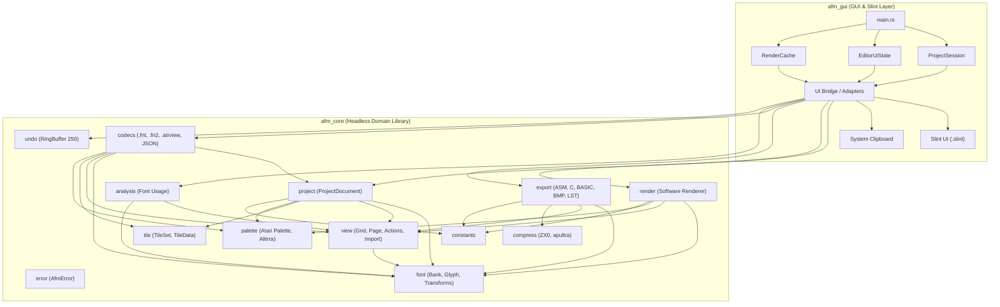

# Architektura Docelowa Aplikacji Rust (Atari FontMaker)

> **Status**: Specyfikacja Architektury Technicznej Części Rust (Zaktualizowana po Review)  
> **Wersja**: 1.1.0  
> **Data**: 2026-08-14  
> **Dokumenty źródłowe**: `docs/architecture.md`, `docs/migration-plan.md`, `docs/testing-strategy.md`, `docs/reference-harness-audit.md`

---

## 1. Wprowadzenie i Założenia Projektowe

Celem projektu jest pełna migracja aplikacji **Atari FontMaker** z monolitycznego kodu C# (.NET 9 WinForms) do nowoczesnego, bezpiecznego i idiomatycznego ekosystemu **Rust (edycja 2024)** ze środowiskiem graficznym **Slint UI**.

### 1.1. Podstawowe zasady architektoniczne
1. **Bezwzględna separacja domeny od GUI**: 100% logiki biznesowej, formatów plików, transformacji bitowych, renderera programowego i eksporterów znajduje się w dedykowanej bibliotece `afm_core`, która nie posiada żadnych zależności od GUI, okien ani serwera graficznego.
2. **Brak globalnego stanu mutowalnego**: Eliminacja statycznych klas C# (`AtariFont`, `AtariView`, `Configuration`). Stan jest podzielony na logiczną sesję domenową (`ProjectSession`), stan interakcji UI (`EditorUiState`) i bufor renderowania (`RenderCache`).
3. **Pamięciowe bezpieczeństwo (Safe Rust)**: Całkowity brak bloków `unsafe` w kodzie produkcyjnym. Manipulacje bitowe i operacje na buforach pikseli opierają się na bezpiecznych iteratorach, plastrach (`slices`) i operacjach optymalizowanych przez kompilator.
4. **Deterministyczna kompatybilność behawioralna**: Zachowanie 100% zgodności z referencyjnymi fixtures wygenerowanymi przez C# Reference Harness (`tests/fixtures/`).
5. **Natywna wieloplatformowość (Windows / Linux)**: Zastąpienie zewnętrznych procesów `.exe` (kompresory ZX0/apultra) natywnymi crate'ami Rust lub czystym kodem Rust bez procesów zewnętrznych OS.
6. **Brak zbędnych zależności Cargo**: Wykorzystanie biblioteki standardowej Rust (np. natywna obsługa Little-Endian w `std` zamiast `byteorder`).

---

## 2. Podział na Pakiety (Workspace Structure)

Struktura projektu zostaje zorganizowana jako Cargo Workspace złożony z dwóch głównych pakietów:

```
atari-font-maker-rust/
├── Cargo.toml                       # Workspace manifest
├── crates/
│   ├── afm_core/                    # Czysta biblioteka domenowa (Headless Core)
│   │   ├── Cargo.toml
│   │   └── src/
│   │       ├── lib.rs
│   │       ├── constants.rs         # Stałe systemowe Atari, offsety banków i masek
│   │       ├── error.rs             # System typów błędów domeny (thiserror)
│   │       ├── palette.rs           # Paleta Atari (Altirra PAL) i dopasowanie barw
│   │       ├── font/                # Reprezentacja banków fontów i operacje bitowe
│   │       │   ├── mod.rs
│   │       │   ├── bank.rs          # 4-bankowy bufor fontów (4096 B)
│   │       │   ├── glyph.rs         # Model pojedynczego glifu 8×8 (1/2/4-bit)
│   │       │   ├── transforms.rs    # Rotacje, odbicia lustrzane, przesunięcia
│   │       │   └── bank_ops.rs      # Przesunięcia całobankowe, duplikaty
│   │       ├── view/                # Model ekranu / widoku
│   │       │   ├── mod.rs
│   │       │   ├── grid.rs          # Siatka widoku (32/40/48 × 26)
│   │       │   ├── page.rs          # Strona projektu i zarządzanie stronami
│   │       │   ├── actions.rs       # Wypełnianie, podmiana znaków, operacje MegaCopy
│   │       │   └── import.rs        # Import surowych danych binarnych do widoku
│   │       ├── tile/                # Zestawy kafelków (TileSet)
│   │       │   ├── mod.rs
│   │       │   ├── set.rs           # Kontener 256 kafelków
│   │       │   └── tile_data.rs     # Kafelek 8×8 znaków i transformacje
│   │       ├── analysis/            # Statystyka i analiza użycia fontów
│   │       │   ├── mod.rs
│   │       │   └── usage.rs         # Zliczanie wystąpień glifów w projekcie
│   │       ├── render/              # Programowy renderer pikseli (Software Renderer)
│   │       │   ├── mod.rs
│   │       │   ├── pixel.rs         # Definicje pikseli RGBA i buforów
│   │       │   ├── font_atlas.rs    # Renderowanie pełnego atlasu fontów (512×1024)
│   │       │   ├── glyph_render.rs  # Renderowanie pojedynczego glifu
│   │       │   └── view_render.rs   # Renderowanie ekranu widoku
│   │       ├── codecs/              # Formaty plików i serializacja
│   │       │   ├── mod.rs
│   │       │   ├── binary_fnt.rs    # .fnt (1024 B) i .fn2 (2048 B)
│   │       │   ├── atrview_json.rs  # .atrview (v1911, v2007, v2023)
│   │       │   ├── tile_json.rs     # .atrtileset i .atrtile
│   │       │   ├── clipboard.rs     # Format schowka JSON
│   │       │   └── config_json.rs   # FontMaker.json
│   │       ├── export/              # Generatory kodu i plików wyjściowych
│   │       │   ├── mod.rs
│   │       │   ├── code.rs          # ASM, Action!, BASIC, FastBasic, MADS, C, Pascal
│   │       │   ├── binary.rs        # Eksport surowy (.dat) i listing BASIC (.lst)
│   │       │   └── bmp.rs           # Eksport arkusza do formatu BMP
│   │       ├── compress/            # Natywna kompresja bezstratna
│   │       │   ├── mod.rs
│   │       │   ├── traits.rs        # Abstrakcja CompressorCodec
│   │       │   └── zx0.rs           # Adaptery ZX0/ZX1/ZX2/apultra
│   │       ├── undo/                # Maszyna stanów historii operacji
│   │       │   ├── mod.rs
│   │       │   ├── ring_buffer.rs   # Deterministyczny bufor kołowy (250 stanów)
│   │       │   ├── font_undo.rs     # Historia edycji czcionek
│   │       │   └── view_undo.rs     # Historia edycji widoków per strona
│   │       └── project.rs           # Agregat dokumentu projektu
│   │
│   └── afm_gui/                     # Aplikacja GUI (Slint Shell + UI Adapters)
│       ├── Cargo.toml
│       ├── build.rs                 # Kompilacja plików .slint (slint-build)
│       ├── ui/                      # Definicje interfejsu Slint
│       │   ├── main_window.slint
│       │   ├── components/          # Panele, palety, edytor glifów, siatka widoku
│       │   └── dialogs/             # Okna dialogowe eksportu, importu, analizy
│       └── src/
│           ├── main.rs              # Punkt wejścia aplikacji GUI
│           ├── session.rs           # Zarządzanie sesją domenową i undo/redo
│           ├── ui_state.rs          # Stan interakcji (narzędzia, zaznaczenia)
│           ├── render_cache.rs      # Pamięć podręczna buforów renderera
│           ├── bridge/              # Adaptery między domeną a komponentami Slint
│           │   ├── mod.rs
│           │   ├── image_adapter.rs # Konwersja buforów renderera do slint::Image
│           │   ├── callbacks.rs     # Obsługa zdarzeń i komend z UI
│           │   └── dialog_host.rs   # Kontrolery okien modalnych i pomocniczych
│           └── clipboard_service.rs # Integracja ze schowkiem systemowym OS
└── tests/                           # Integracyjne testy referencyjne i golden-master
    ├── fixtures/                    # Dane referencyjne z C# Reference Harness
    ├── test_transforms.rs
    ├── test_encodings.rs
    ├── test_palette.rs
    ├── test_codecs.rs
    ├── test_renders.rs
    ├── test_exports.rs
    ├── test_analysis.rs
    └── test_undo.rs
```

---

## 3. Odpowiedzialności i Zależności Modułów

### 3.1. Diagram Zależności



### 3.2. Szczegółowe Zakresy Odpowiedzialności

| Moduł | Odpowiedzialność | Czystość od GUI |
|---|---|---|
| `afm_core::constants` | Globalne stałe specyfikacji Atari 8-bit, offsety banków (0x400 per bank), adresy bazowe, stałe masek bitowych i domyślne kolory startowe. | 100% Headless |
| `afm_core::palette` | Wczytywanie binarnej palety 768 B (`altirraPAL.pal`), tablica 256 kolorów RGB, algorytm `find_closest` oparty na odległości euklidesowej (tylko parzyste indeksy rejestrów Atari), mapowanie zestawów barw dla trybów graficznych. | 100% Headless |
| `afm_core::font` | Bufor pamięci dla 4 banków czcionek (4096 B, 512 znaków po 8 B). Dekodowanie i kodowanie bitowe: 1-bit Mono, 2-bit Mode 4/5, 4-bit Mode 10. Algorytmy transformacji glifów: rotacja 90° CW/CCW, odbicie poziome/pionowe, przesunięcia pikselowe z zawijaniem, inwersja bitowa, czyszczenie. Operacje całobankowe (`shift_left`, `shift_right`, `delete_and_shift`, sprawdzanie duplikatów). | 100% Headless |
| `afm_core::view` | Siatka znaków ekranu (szerokości 32, 40, 48 kolumn; 26 wierszy). Mapowanie banku czcionki na każdy wiersz (`use_font_on_line`). Zarządzanie stronami widoku (`PageData`), operacje wypełniania, podmiany znaków, wycinania i wklejania blokowego (MegaCopy) oraz import surowych danych binarnych. | 100% Headless |
| `afm_core::tile` | Zestaw 256 kafelków (matryce 8×8 komórek znakowych). Obsługa opcjonalnych komórek (puste pola), mapowanie fontów per kafelek, transformacje kafelków. | 100% Headless |
| `afm_core::analysis` | Analiza częstości występowania glifów w projekcie (`FontAnalysis`), zliczanie użycia każdego znaku we wszystkich stronach widoku. | 100% Headless |
| `afm_core::render` | Szybki software renderer produkujący standardowe płaskie bufory pamięci pikseli RGBA8 (`[u8; 4]`): renderowanie całego atlasu czcionek (512×1024 px), renderowanie pojedynczych glifów dla edytora, renderowanie ekranu widoku (z uwzględnieniem podwójnej wysokości w Mode 5, kolorów trybów 2/4/5/10 oraz reguły inwersji PF2/PF3 dla znaków 128..255). | 100% Headless |
| `afm_core::codecs` | Bezstratny odczyt i zapis formatów binarnych (`.fnt`, `.fn2`) oraz formatów JSON (`.atrview` ze wsteczną kompatybilnością dla wersji legacy v1911, v2007 i v2023, `.atrtileset`, `.atrtile`, `ClipboardJson`). | 100% Headless |
| `afm_core::export` | Generatory kodu źródłowego (Assembler, Action!, Atari BASIC, FastBasic, MADS, C, Mad Pascal), formatu binarnego (`.dat`), listingów Atari BASIC (`.lst` scalany z szablonem) oraz arkuszy graficznych BMP (24/32-bit). | 100% Headless |
| `afm_core::compress` | Implementacje algorytmów kompresji ZX0, ZX1, ZX2 i apultra w pamięci RAM, ukryte za wspólnym traitem `CompressorCodec`. | 100% Headless |
| `afm_core::undo` | Deterministyczny bufor kołowy 250 migawek stanu (dokładna zgodność z logiką `AtariFontUndoBuffer` i `AtariViewUndoBuffer` z C#). | 100% Headless |
| `afm_gui` | Powłoka aplikacji Slint, stan interakcji UI (`EditorUiState`), adaptery mostkujące domenę do Slinta, buforowanie obrazów (`slint::Image`), obsługa zdarzeń i skrótów klawiaturowych, okna dialogowe. | Warstwa GUI |

---

## 4. Model Danych (Domain Data Model)

Architektura wykorzystuje silne typowanie domenowe i struktury o ścisłych niezmiennikach.

### 4.1. Podstawowe Typy Domenowe

```rust
#[derive(Debug, Clone, Copy, PartialEq, Eq, Hash)]
pub struct FontBankIndex(pub u8); // Zakres: 0..=3 (odpowiada 4 bankom)

#[derive(Debug, Clone, Copy, PartialEq, Eq, Hash)]
pub struct CharIndex(pub u8); // Zakres: 0..=127 w obrębie banku

#[derive(Debug, Clone, Copy, PartialEq, Eq, Hash)]
pub struct GlobalCharIndex(pub u16); // Zakres: 0..=511 w obrębie projektu

impl GlobalCharIndex {
    pub fn from_bank_and_char(bank: FontBankIndex, ch: CharIndex) -> Self {
        Self((bank.0 as u16) * 128 + (ch.0 as u16))
    }
    pub fn to_bank_and_char(self) -> (FontBankIndex, CharIndex) {
        (FontBankIndex((self.0 / 128) as u8), CharIndex((self.0 % 128) as u8))
    }
}

#[derive(Debug, Clone, Copy, PartialEq, Eq)]
pub enum ColorMode {
    Mode2Mono,       // 1-bit: 2 kolory (tło, znak)
    Mode4Color,      // 2-bit: 5 kolorów (BAK, PF0, PF1, PF2, PF3 / inwersja)
    Mode5Color,      // 2-bit: 5 kolorów z podwójną wysokością linii
    Mode10Color,     // 4-bit: 9 kolorów (BAK + 8 rejestrów)
}

#[derive(Debug, Clone, Copy, PartialEq, Eq)]
pub struct RgbColor {
    pub r: u8,
    pub g: u8,
    pub b: u8,
}

#[derive(Debug, Clone, Copy, PartialEq, Eq)]
pub struct PaletteIndex(pub u8); // Zakres: 0..=255 (rejestry kolorów Atari)
```

### 4.2. Model Czcionki i Glifów (`afm_core::font`)

```rust
pub const FONT_BANK_SIZE: usize = 1024;      // 128 znaków * 8 bajtów
pub const TOTAL_FONTS_SIZE: usize = 4096;    // 4 banki = 512 znaków * 8 bajtów
pub const GLYPH_HEIGHT: usize = 8;
pub const GLYPH_WIDTH: usize = 8;

#[derive(Debug, Clone, PartialEq, Eq)]
pub struct FontBankSet {
    bytes: [u8; TOTAL_FONTS_SIZE],
}

#[derive(Debug, Clone, Copy, PartialEq, Eq)]
pub struct GlyphBytes(pub [u8; GLYPH_HEIGHT]);

#[derive(Debug, Clone, Copy, PartialEq, Eq)]
pub struct GlyphMatrix {
    pub pixels: [[u8; GLYPH_WIDTH]; GLYPH_HEIGHT],
}
```

### 4.3. Model Ekranu Widoku (`afm_core::view`)

```rust
pub const DEFAULT_VIEW_WIDTH: usize = 40;
pub const DEFAULT_VIEW_HEIGHT: usize = 26;

#[derive(Debug, Clone, Copy, PartialEq, Eq)]
pub struct ViewDimensions {
    pub width: usize,   // Obsługiwane wartości: 32, 40, 48
    pub height: usize,  // Stała wartość: 26
}

#[derive(Debug, Clone, PartialEq, Eq)]
pub struct PageData {
    pub id: u32,
    pub name: String,
    pub width: usize,
    pub height: usize,
    pub chars: Vec<u8>,             // Rozmiar: width * height bajtów
    pub use_font_on_line: [u8; 26], // Indeks banku czcionki (0..3) per linia
    pub selected_char_index: u8,
    pub view_offset_x: i32,
    pub view_offset_y: i32,
}
```

### 4.4. Model Zestawu Kafelków (`afm_core::tile`)

```rust
pub const TILE_SET_SIZE: usize = 256;
pub const TILE_GRID_DIM: usize = 8;

#[derive(Debug, Clone, Copy, PartialEq, Eq)]
pub struct TileCell {
    pub char_code: Option<u8>,
}

#[derive(Debug, Clone, PartialEq, Eq)]
pub struct TileData {
    pub grid: [[TileCell; TILE_GRID_DIM]; TILE_GRID_DIM],
    pub font_index: u8,
    pub color_mode: ColorMode,
}

#[derive(Debug, Clone, PartialEq, Eq)]
pub struct TileSet {
    pub tiles: Vec<TileData>, // Zawsze 256 elementów
    pub selected_tile: u8,
}
```

### 4.5. Model Konfiguracji Kolorów Projektu

```rust
#[derive(Debug, Clone, PartialEq, Eq)]
pub struct ProjectColors {
    pub color_mode: ColorMode,
    pub background: PaletteIndex,
    pub color0: PaletteIndex,
    pub color1: PaletteIndex,
    pub color2: PaletteIndex,
    pub color3: PaletteIndex,
    pub extra_colors: [PaletteIndex; 4],
}
```

### 4.6. Główny Agregat Dokumentu Projektu (`ProjectDocument`)

```rust
#[derive(Debug, Clone, PartialEq, Eq)]
pub struct ProjectDocument {
    pub fonts: FontBankSet,
    pub pages: Vec<PageData>,
    pub active_page_index: usize,
    pub tileset: TileSet,
    pub colors: ProjectColors,
}
```

---

## 5. Publiczne API Modułów `afm_core`

### 5.1. `afm_core::palette`

```rust
pub struct AtariPalette {
    entries: [RgbColor; 256],
}

impl AtariPalette {
    pub fn from_bytes(bytes: &[u8]) -> Result<Self, AfmError>;
    pub fn get_rgb(&self, index: PaletteIndex) -> RgbColor;
    pub fn find_closest_even(&self, target: RgbColor) -> PaletteIndex;
}
```

### 5.2. `afm_core::font::transforms`

```rust
pub struct GlyphTransforms;

impl GlyphTransforms {
    pub fn rotate_left(glyph: &GlyphBytes) -> GlyphBytes;
    pub fn rotate_right(glyph: &GlyphBytes) -> GlyphBytes;
    pub fn mirror_horizontal(glyph: &GlyphBytes, mode: ColorMode) -> GlyphBytes;
    pub fn mirror_vertical(glyph: &GlyphBytes) -> GlyphBytes;
    pub fn shift_up(glyph: &GlyphBytes) -> GlyphBytes;
    pub fn shift_down(glyph: &GlyphBytes) -> GlyphBytes;
    pub fn shift_left(glyph: &GlyphBytes, mode: ColorMode) -> GlyphBytes;
    pub fn shift_right(glyph: &GlyphBytes, mode: ColorMode) -> GlyphBytes;
    pub fn invert(glyph: &GlyphBytes) -> GlyphBytes;
    pub fn clear() -> GlyphBytes;
}
```

### 5.3. `afm_core::view::actions` & `afm_core::view::import`

```rust
pub struct ViewActions;

impl ViewActions {
    pub fn replace_character(page: &mut PageData, old_char: u8, new_char: u8);
    pub fn replace_character_all_pages(pages: &mut [PageData], old_char: u8, new_char: u8);
    pub fn fill_region(page: &mut PageData, char_code: u8, x: usize, y: usize, w: usize, h: usize);
    pub fn invert_region(page: &mut PageData, x: usize, y: usize, w: usize, h: usize);
}

pub struct ViewImporter;

#[derive(Debug, Clone)]
pub struct RawImportOptions {
    pub offset_bytes: usize,
    pub source_width: usize,
    pub transpose: bool,
}

impl ViewImporter {
    pub fn import_raw_binary(
        raw_data: &[u8],
        target_page: &mut PageData,
        options: &RawImportOptions,
    ) -> Result<(), CodecError>;
}
```

### 5.4. `afm_core::analysis`

```rust
pub struct FontAnalysisResult {
    pub character_counts: [usize; 512],
    pub total_characters_used: usize,
}

pub struct FontAnalyzer;

impl FontAnalyzer {
    pub fn analyze_usage(doc: &ProjectDocument) -> FontAnalysisResult;
}
```

### 5.5. `afm_core::render`

```rust
pub struct SoftwareRenderer;

impl SoftwareRenderer {
    pub fn render_font_atlas(
        fonts: &FontBankSet,
        palette: &AtariPalette,
        colors: &ProjectColors,
        target_buf: &mut [u8], // Bufor RGBA8 (512 * 1024 * 4 bajty)
    ) -> Result<(), RenderError>;

    pub fn render_glyph(
        glyph: &GlyphBytes,
        mode: ColorMode,
        is_inverted: bool,
        palette: &AtariPalette,
        colors: &ProjectColors,
        scale: usize,
        target_buf: &mut [u8],
    ) -> Result<(), RenderError>;

    pub fn render_view_page(
        page: &PageData,
        fonts: &FontBankSet,
        palette: &AtariPalette,
        colors: &ProjectColors,
        target_buf: &mut [u8],
    ) -> Result<(), RenderError>;
}
```

---

## 6. Obsługa Błędów (Error Handling Strategy)

Zastosowano podział: `thiserror` w bibliotece domenowej `afm_core` oraz `anyhow` w aplikacji `afm_gui`.

```rust
use thiserror::Error;

#[derive(Error, Debug)]
pub enum AfmError {
    #[error("Błąd palety: {0}")]
    Palette(#[from] PaletteError),

    #[error("Błąd formatu/kodeka: {0}")]
    Codec(#[from] CodecError),

    #[error("Błąd renderowania: {0}")]
    Render(#[from] RenderError),

    #[error("Błąd eksportu: {0}")]
    Export(#[from] ExportError),

    #[error("Nieprawidłowy indeks: {0}")]
    IndexOutOfBounds(String),

    #[error("Błąd operacji wejścia/wyjścia: {0}")]
    Io(#[from] std::io::Error),
}
```

---

## 7. Zarządzanie Stanem Aplikacji (Application State & Decoupling)

Aby uniknąć monolitycznego obiektu `AppState`, stan w `afm_gui` został rozdzielony na 3 niezależne struktury:

```
┌─────────────────────────────────────────────────────────────┐
│                       ProjectSession                        │
│   - ProjectDocument (Czyste dane domenowe)                  │
│   - AtariPalette                                            │
│   - FontUndoBuffer & ViewUndoBuffers                        │
└──────────────────────────────┬──────────────────────────────┘
                               │
┌──────────────────────────────▼──────────────────────────────┐
│                       EditorUiState                         │
│   - Selected Bank / Selected Char                           │
│   - Active Color Register / Active Tool                     │
│   - MegaCopy Selection Coordinates                          │
└──────────────────────────────┬──────────────────────────────┘
                               │
┌──────────────────────────────▼──────────────────────────────┐
│                        RenderCache                          │
│   - Cached RGBA8 Buffers (Font Atlas, View, Glyph)          │
│   - Slint Image Handles                                     │
└─────────────────────────────────────────────────────────────┘
```

1. **`ProjectSession`**: Posiada dokument projektu oraz historię undo/redo. Niezależny od renderowania i szczegółów UI.
2. **`EditorUiState`**: Przechowuje wyłącznie stan interakcji użytkownika (które narzędzie jest wybrane, zaznaczenie prostokąta MegaCopy).
3. **`RenderCache`**: Składuje zaktualizowane bufory pikseli i uchwyty `slint::Image`, odświeżane na żądanie.

---

## 8. Mostkowanie z GUI Slint (Slint Integration Architecture)

### 8.1. Renderer pikseli a Slint `SharedPixelBuffer`
Renderowanie programowe w `afm_core` zapisuje surowe bajty RGBA8 do ciągłych buforów `&mut [u8]`. Adapter GUI bezpiecznie ładuje dane do `SharedPixelBuffer<Rgba8Pixel>` Slinta:

```rust
use slint::{Image, Rgba8Pixel, SharedPixelBuffer};

pub fn update_slint_image_from_buffer(
    width: u32,
    height: u32,
    source_rgba: &[u8],
) -> Image {
    let mut pixel_buffer = SharedPixelBuffer::<Rgba8Pixel>::new(width, height);
    let dest_slice = pixel_buffer.make_mut_slice();
    
    for (src_chunk, dest_pixel) in source_rgba.chunks_exact(4).zip(dest_slice.iter_mut()) {
        dest_pixel.r = src_chunk[0];
        dest_pixel.g = src_chunk[1];
        dest_pixel.b = src_chunk[2];
        dest_pixel.a = src_chunk[3];
    }
    
    Image::from_rgba8(pixel_buffer)
}
```
*Uwaga*: Dla atlasu 512×1024 (2 MB) kopiowanie bajtów na nowoczesnym CPU zajmuje poniżej 0.1 ms, co całkowicie eliminuje potrzebę skomplikowanych i ryzykownych optymalizacji zerokopiowych w początkowej fazie.

---

## 9. Zestaw Zależności Cargo (Dependencies Inventory)

### 9.1. Zależności `crates/afm_core`

| Crate | Wersja | Cel i Zastosowanie |
|---|---|---|
| `serde` | `1.0` | Serializacja i deserializacja struktur projektowych. |
| `serde_json` | `1.0` | Obsługa formatów `.atrview`, `.atrtileset`, `ClipboardJson`, `FontMaker.json`. |
| `hex` | `0.4` | Kodowanie i dekodowanie ciągów hex w JSON. |
| `thiserror` | `2.0` | Silnie typowane błędy domeny. |

*(Usunięto niepotrzebną zależność `byteorder` — konwersja little-endian realizowana jest przez metody biblioteki standardowej `u16::from_le_bytes`, `u32::to_le_bytes`)*.

### 9.2. Zależności `crates/afm_gui`

| Crate | Wersja | Cel i Zastosowanie |
|---|---|---|
| `afm_core` | `path = "../afm_core"` | Biblioteka domenowa. |
| `slint` | `1.9` | Framework interfejsu graficznego. |
| `rfd` | `0.15` | Natywne okna dialogowe wyboru plików dla Windows i Linux. |
| `arboard` | `3.4` | Obsługa schowka systemowego OS. |
| `anyhow` | `1.0` | Elastyczna obsługa błędów w powłoce GUI. |

### 9.3. Zależności Testowe (`dev-dependencies`)

| Crate | Wersja | Cel i Zastosowanie |
|---|---|---|
| `image` | `0.25` | Weryfikacja poprawności zrzutów PNG/BMP w testach integracyjnych golden master. |
| `pretty_assertions` | `1.4` | Czytelne raportowanie różnic w testach tekstowych i binarnych. |

---

## 10. Strategia Testowania Części Rust

Wszystkie testy domeny, algorytmów, kodeków i renderera są w 100% headless i nie wymagają aktywnego serwera GUI ani kompilacji Slinta:

```bash
cargo test -p afm_core
```

Wszystkie 53 zestawy wektorów z `tests/fixtures/` są bezpośrednio wykorzystywane w testach integracyjnych `tests/test_*.rs`.
